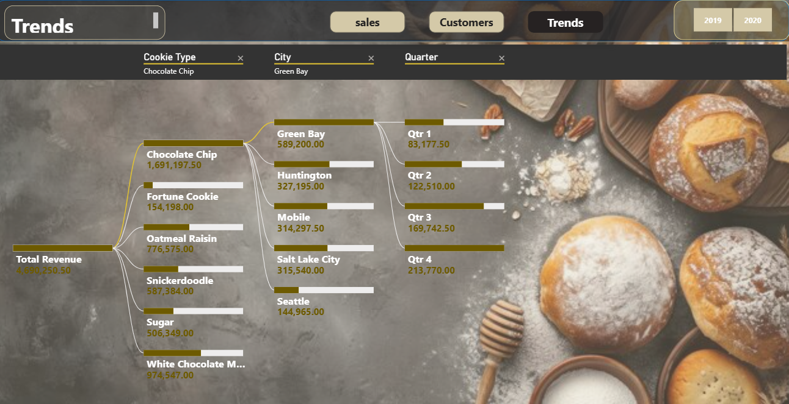
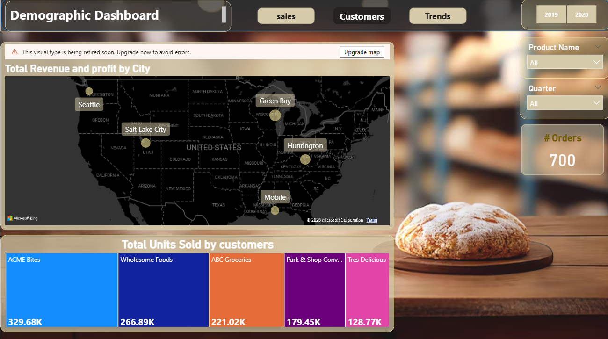

# 🍪 Cookies Sales Dashboard – Power BI Project

## 📌 Project Overview
An interactive Sales Dashboard built using Power BI to analyze cookie sales performance across products, customers, cities, and time.

---

## 🔢 Key Performance Indicators

- **Total Revenue:** $4.69M
- **Total Profit:** $2.72M
- **Profit Margin:** 57.93%
- **Total Units Sold:** 1.13M
- **Number of Orders:** 700
- **Total Cost:** $1.97M

---

## 📅 Sales Trends

- Monthly sales analysis
- Quarterly performance comparison
- Revenue growth patterns

---

## 🏷️ Product Performance

### Top Products by Units Sold:
- Chocolate Chip – 338.24K
- Sugar – 168.78K
- White Chocolate – 162.42K
- Oatmeal Raisin – 155.32K
- Fortune Cookie – 154.2K

### Profit Contribution by Product
Analysis of profitability by product category.

---

## 👥 Customer Insights

Top Customers:
- ACME Bites
- Wholesome Foods
- ABC Groceries
- Park & Shop Co
- Tres Delicious

---

## 🛠 Tools & Technologies

- Power BI Desktop
- Data Modeling
- DAX Measures
- Interactive Visualizations
- KPI Cards
- Filters & Slicers

---

## 📷 Dashboard Preview

---

## 🎯 Business Value

- Identifies best-performing products
- Highlights profit-driving segments
- Tracks monthly and quarterly trends
- Supports data-driven decision-making

